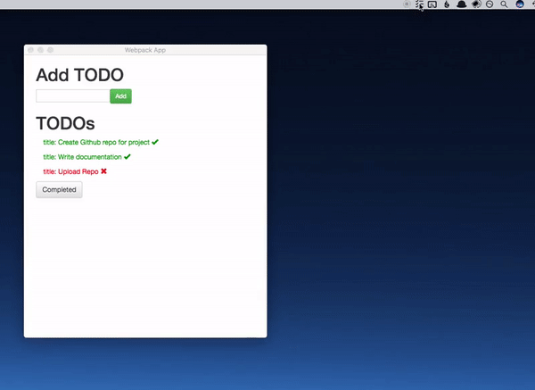

# Electron App using TypeScript and React




This project is an end-to-end example of an application(with a [menubar](https://github.com/maxogden/menubar)) using [React](https://reactjs.org/), [Typescript](https://www.typescriptlang.org/) and is being packaged with [electron-forge](https://github.com/electron-userland/electron-forge). 

Other things to note... keeping state in sync between different windows(process), the [redux-electron-store](https://github.com/samiskin/redux-electron-store) was used.

The following projects were referenced:  
- [electron-blog](https://github.com/romanschejbal/electron-blog)

## Getting Started
```bash
# Clone the Quick Start repository
$ git clone https://github.com/initFabian/electron-redux-ts-todo

# Go into the repository
$ cd electron-quick-start

# Install the dependencies
$ npm install

# Run project
$ npm run dev
```

## Packaging 

```bash

# Package up application
$ npm run package

# Make application(create zip file)
$ npm run make

# Package application and upload it to github
$ npm run publish
```